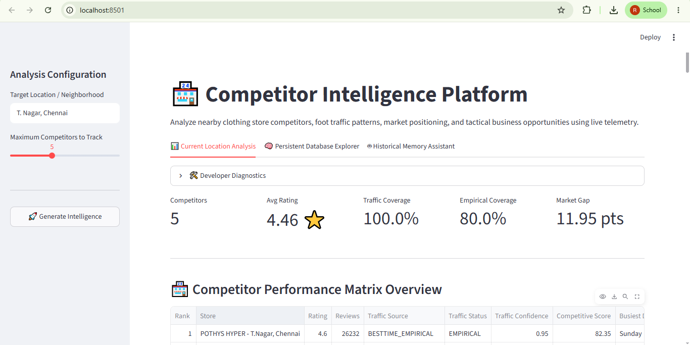
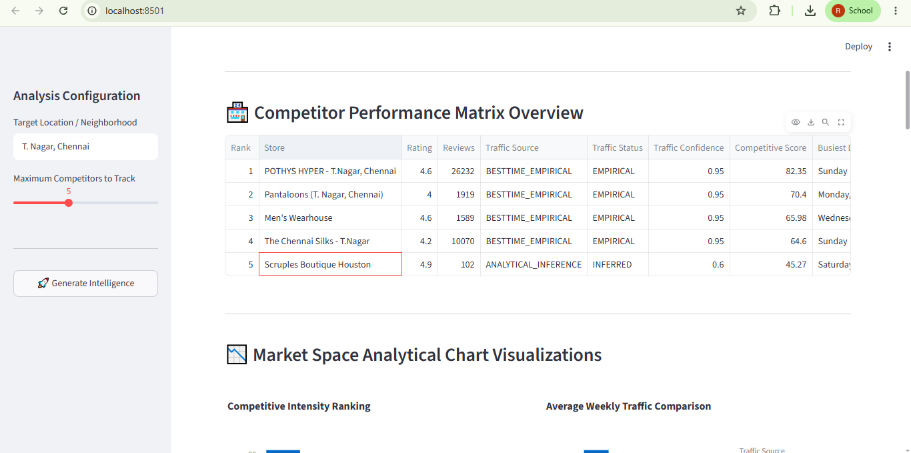
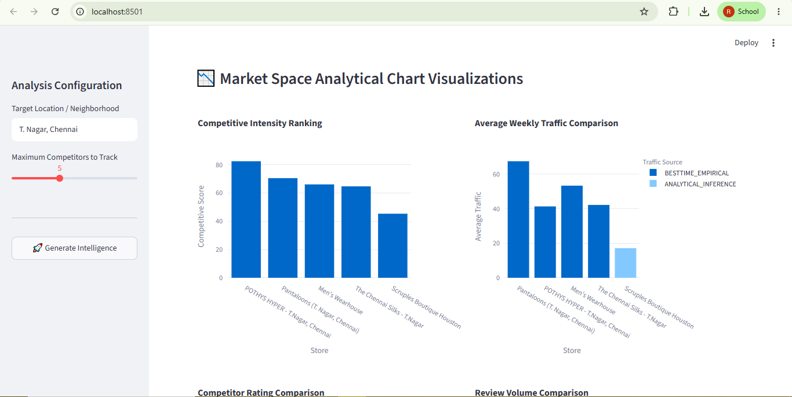
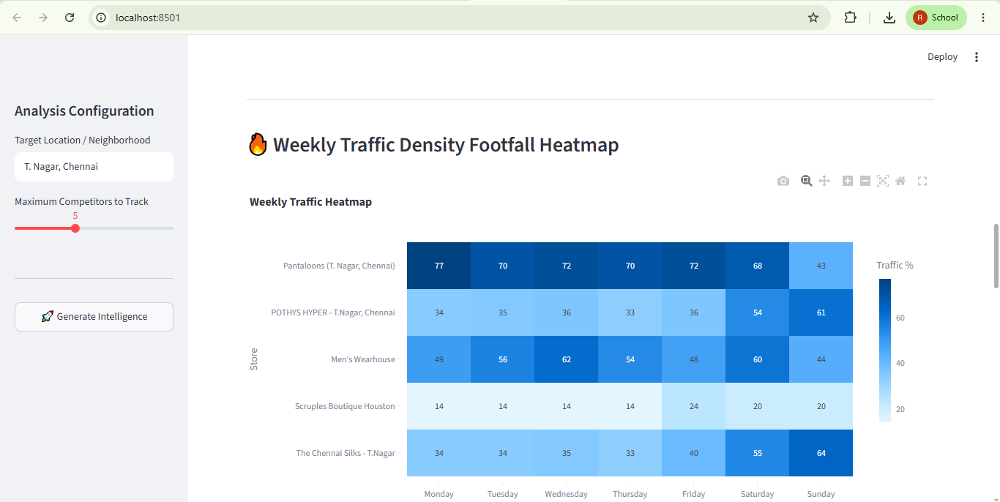
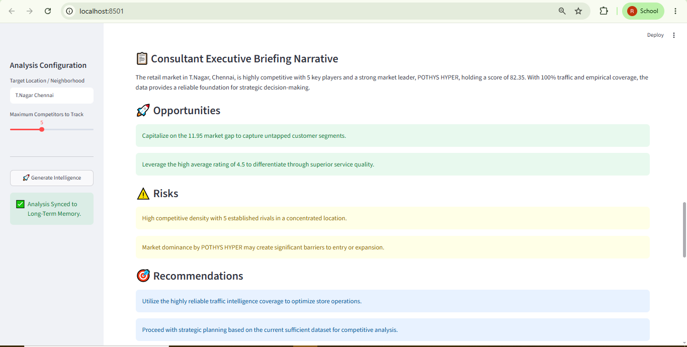
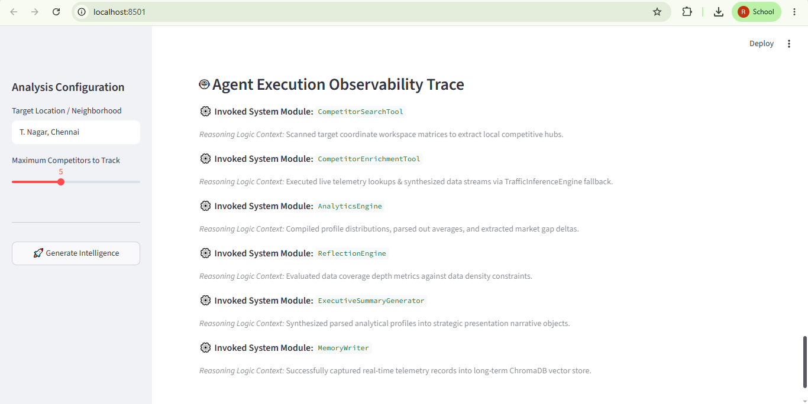
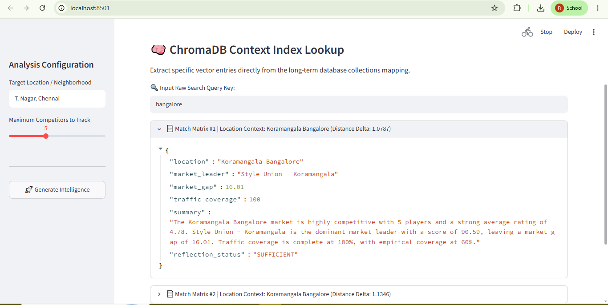
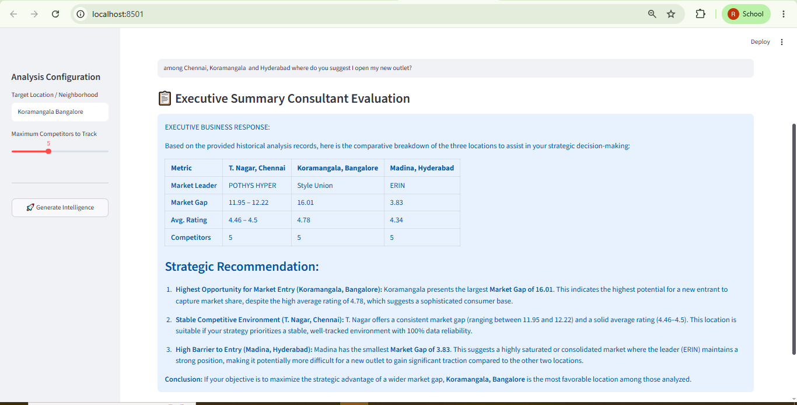
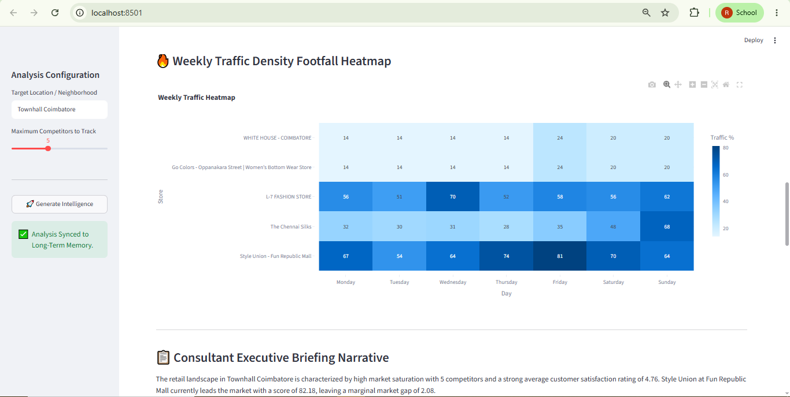
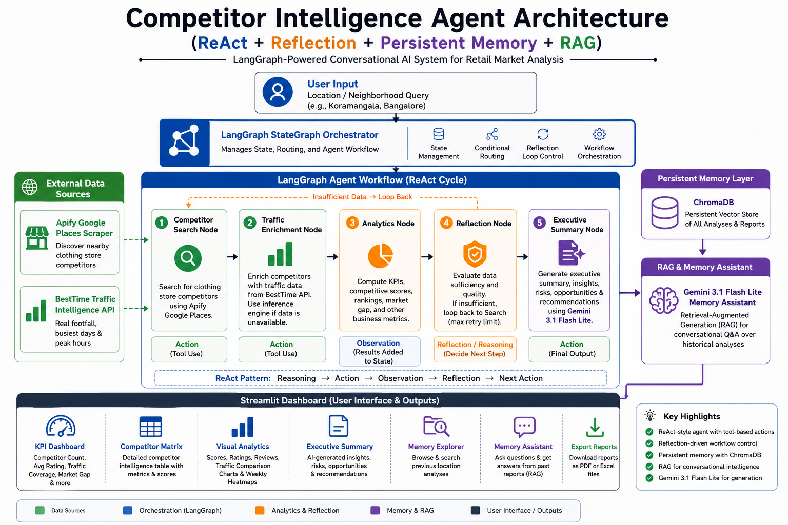

# 🏪 Competitor Intelligence Agent

[](https://www.python.org/)
[](https://github.com/langchain-ai/langgraph)
[](https://github.com/chroma-core/chroma)
[](https://aistudio.google.com/)

> A **LangGraph (StateGraph)-powered ReAct-style Reflective agentic system** for retail market analysis — combining real-time competitor discovery, empirical traffic intelligence, reflection-driven workflow validation, persistent vector memory, and AI-generated executive reporting into a single conversational platform.

---

## 📸 Screenshots

### Main Dashboard & KPI Overview



> *Five-metric KPI ribbon — Competitor Count, Average Rating, Traffic Coverage, Empirical Coverage, and Market Gap — computed from live telemetry.*

---

### Competitor Performance Matrix



> *Full competitor intelligence table with ratings, review volumes, traffic scores, busiest days, and competitive rankings.*

---

### Visual Analytics Suite





> *Competitive Score Chart, Traffic Comparison, Ratings Distribution, Reviews Analysis, and Weekly Traffic Density Heatmap — all powered by Plotly.*

---

### Executive Briefing & Strategic Recommendations



> *AI-generated executive summary with identified Opportunities, Risks, and Tactical Recommendations surfaced from market data.*

---

### Agent Execution Observability Trace



> *Trace log mapping the sequential data flow, tool execution nodes, and self-correcting reflection loops orchestrated by the LangGraph StateGraph engine.*

---

### Memory Explorer & RAG Assistant





> *ChromaDB vector store search and Gemini-powered conversational assistant for querying historical market analyses.*

---

### 🎬 Demo Video

[]([https://youtu.be/IVjP-WncRB0])

> *Click the thumbnail above to watch a full walkthrough of the agentic workflow.*

---

## 🏗️ Architecture



> *System architecture — LangGraph StateGraph workflow with ReAct-style conditional reflection loop, external tool integrations, and Streamlit presentation layer.*

### High-Level Workflow

```
User Input (Location + Max Competitors)
            │
            ▼
   [LangGraph StateGraph Orchestrator]
            │
            ▼
  ┌──────────────────────────┐
  │   Competitor Search Node │  ← Apify Google Places Scraper
  │   (Tool Use — ReAct)     │    Discovers nearby clothing stores
  └────────────┬─────────────┘
               │
               ▼
  ┌──────────────────────────┐
  │  Traffic Enrichment Node │  ← BestTime Traffic Intelligence API
  │   (Tool Use — ReAct)     │    Empirical footfall + busiest days
  │                          │    → Analytical Inference Fallback Engine
  └────────────┬─────────────┘
               │
               ▼
  ┌──────────────────────────┐
  │    Analytics Node        │  ← KPIs, Competitive Scores, Market Gap
  │   (Observation — ReAct)  │    Ratings, Reviews, Traffic Coverage
  └────────────┬─────────────┘
               │
               ▼
  ┌──────────────────────────┐
  │    Reflection Node       │  ← Validates data sufficiency
  │      (Reflection)        │    SUFFICIENT → proceed
  └────────────┬─────────────┘    INSUFFICIENT → loop back to Search
               │
       ┌───────┴────────┐
       │                │
  SUFFICIENT      INSUFFICIENT
       │           (max retry cap)
       │                │
       │                └──── loops back to Search Node
       ▼
  ┌──────────────────────────┐
  │  Executive Summary Node  │  ← Gemini synthesizes summary, risks,
  │     (Action — ReAct)     │    opportunities, recommendations
  └────────────┬─────────────┘
               │
               ▼
  ┌──────────────────────────┐
  │   ChromaDB Memory Layer  │  ← Vectorizes & persists each analysis
  └────────────┬─────────────┘
               │
               ▼
  ┌──────────────────────────┐
  │   Gemini RAG Assistant   │  ← Conversational Q&A over all stored
  └────────────┬─────────────┘    historical intelligence
               │
               ▼
     Streamlit Dashboard
     ├── KPI Metrics Ribbon
     ├── Competitor Performance Matrix
     ├── Visual Analytics Suite (Plotly)
     ├── Executive Briefing Narrative
     ├── Reflection Status Assessment
     ├── Memory Explorer (ChromaDB)
     ├── Historical Memory Assistant (RAG)
     └── PDF / Excel Export
```

---

## ✨ Features

- **ReAct-style agentic workflow** — the agent reasons, acts via tool calls, observes results, and reflects before proceeding to report generation; never a single-pass LLM call
- **Reflection-driven validation** — a dedicated Reflection Engine evaluates data sufficiency (competitor count, traffic coverage, data completeness) before synthesis; loops back to search if insufficient
- **Dual-layer traffic intelligence** — BestTime empirical API for real footfall data; analytical inference fallback engine for stores without coverage, guaranteeing 100% traffic profiles
- **Weighted competitive scoring** — multi-factor scoring engine ranking competitors by rating performance, review volume, and traffic strength
- **Persistent vector memory** — every completed analysis is stored in ChromaDB; supports cross-session retrieval and longitudinal market comparison
- **Gemini RAG assistant** — conversational interface over all stored analyses; ask questions like *"Which location had the highest market gap?"* across all historical runs
- **AI-generated executive briefing** — Gemini synthesizes market summary, identified risks, strategic opportunities, and tactical recommendations from raw analytics
- **Full export suite** — download presentation-grade PDF reports and structured Excel data files directly from the dashboard
- **Agent observability trace** — live step-by-step execution log of every module invoked, surfaced in the UI for transparency
- **Session state persistence** — analysis results survive sidebar interactions without re-running the pipeline

---

## ⚙️ Tech Stack

| Component | Technology |
|---|---|
| Frontend | Streamlit |
| Workflow Orchestration | LangGraph (StateGraph) |
| Agent Framework | LangChain |
| Large Language Model | Google Gemini Flash Lite |
| Vector Database | ChromaDB |
| Competitor Discovery | Apify Google Places Scraper |
| Traffic Intelligence | BestTime Traffic Intelligence API |
| Visualization | Plotly |
| Data Processing | Pandas |
| PDF Export | ReportLab |
| Excel Export | OpenPyXL |
| Language | Python 3.10+ |

---

## 📁 Project Structure

```
competitor_intelligence_agent/
│
├── streamlit_app.py           # Streamlit dashboard — UI, session state, result rendering
│
├── agent/                     # LangGraph agent graph definition
│
├── workflow/
│   ├── langgraph_workflow.py  # LangGraph StateGraph — nodes, edges, conditional router
│   └── reflection.py         # Reflection Engine — SUFFICIENT / INSUFFICIENT validation
│
├── tools/
│   ├── competitor_search.py       # Apify Google Places crawler integration
│   ├── competitor_adapter.py      # Raw data normalization layer
│   └── competitor_enrichment.py   # BestTime + Inference fallback traffic engine
│
├── analytics/
│   ├── metrics.py                 # Core KPI computation engine
│   ├── competitive_scoring.py     # Weighted multi-factor scoring engine
│   └── dashboard_metrics.py       # Dashboard-ready metric objects
│
├── visualization/
│   ├── competitor_table.py        # Competitor performance matrix builder
│   ├── traffic_chart.py           # Traffic comparison chart
│   ├── ratings_chart.py           # Ratings distribution chart
│   ├── reviews_chart.py           # Reviews volume chart
│   ├── competitive_score_chart.py # Leaderboard chart
│   └── traffic_heatmap.py         # Weekly traffic density heatmap
│
├── reporting/
│   ├── executive_summary.py       # Gemini executive narrative generator
│   └── recommendation_engine.py  # Strategic recommendation synthesizer
│
├── export/
│   ├── pdf_exporter.py            # ReportLab PDF report generator
│   └── excel_exporter.py          # OpenPyXL Excel data exporter
│
├── memory/
│   ├── memory_writer.py           # ChromaDB vector ingestion engine
│   ├── memory_retriever.py        # Semantic similarity search engine
│   └── memory_qa_agent.py         # Gemini RAG conversational Q&A agent
│
├── memory_db/                     # Persistent ChromaDB storage
├── models/                        # Shared data models
├── config/                        # Configuration and environment settings
├── cache_data/                    # Cached API responses
├── analytics/                     # (see above)
├── .env                           # API keys (not committed)
├── requirements.txt               # Python dependencies
└── README.md
```

---

## 🚀 Getting Started

### 1. Clone the repository

```bash
git clone https://github.com/your-username/competitor-intelligence-agent.git
cd competitor-intelligence-agent
```

### 2. Create and activate a virtual environment

```bash
python -m venv venv

# Windows
venv\Scripts\activate

# macOS / Linux
source venv/bin/activate
```

### 3. Install dependencies

```bash
pip install -r requirements.txt
```

### 4. Set up environment variables

Create a `.env` file in the project root:

```env
GEMINI_API_KEY=your_gemini_api_key_here
APIFY_API_TOKEN=your_apify_api_token_here
BESTTIME_API_KEY=your_besttime_api_key_here
```

### 5. Run the Streamlit app

```bash
streamlit run streamlit_app.py
```

Open [http://localhost:8501](http://localhost:8501) in your browser.

---

## 🔑 Getting API Keys

| Service | Free Tier | Link |
|---|---|---|
| Gemini | Yes (generous limits) | [aistudio.google.com](https://aistudio.google.com) |
| Apify | Yes (limited monthly runs) | [apify.com](https://apify.com) |
| BestTime | Yes (limited lookups) | [besttime.app](https://besttime.app) |

---

## 🔄 How the ReAct + Reflection Loop Works

This is the core distinguishing feature of the system. Unlike a standard single-pass competitor search:

1. **Search (Action)** — the agent queries Apify's Google Places crawler to discover nearby clothing store competitors within the target location.
2. **Enrichment (Action)** — each discovered competitor is enriched with traffic intelligence via BestTime API. If empirical data is unavailable, the analytical inference fallback engine generates realistic traffic estimates from review volume and popularity indicators.
3. **Analytics (Observation)** — the Analytics Engine computes KPIs, competitive scores, market gap metrics, and leaderboard rankings. Results are added to the shared LangGraph state.
4. **Reflection (Reasoning)** — the Reflection Engine evaluates data sufficiency across four dimensions: competitor count, traffic coverage, data completeness, and analytical confidence. It produces a `SUFFICIENT` or `INSUFFICIENT` verdict.
5. **Conditional branch** — if `INSUFFICIENT` and the loop count is below the retry cap, the graph routes back to the Search node for additional data collection. If `SUFFICIENT`, the workflow proceeds to synthesis.
6. **Executive Summary (Action)** — Gemini synthesizes the validated analytics into an executive briefing with risks, opportunities, and strategic recommendations.
7. **Memory persistence** — the completed analysis is vectorized and stored in ChromaDB for cross-session retrieval.

This iterative reasoning-action-observation-reflection cycle ensures reports are always grounded in validated, sufficiently complete market intelligence.

---

## 📊 Dashboard Tabs

### Tab 1 — Current Location Analysis
| Section | Description |
|---|---|
| KPI Ribbon | Competitor Count, Avg Rating, Traffic Coverage, Empirical Coverage, Market Gap |
| Competitor Matrix | Full intelligence table with scores and traffic data |
| Visual Analytics | Competitive Score, Traffic, Ratings, Reviews charts + Weekly Heatmap |
| Executive Briefing | AI-generated summary, risks, opportunities, and recommendations |
| Reflection Status | Data validation outcome with reason context |
| Export Reports | PDF and Excel download buttons |
| Observability Trace | Step-by-step agent execution log |

### Tab 2 — Persistent Database Explorer
Directly query the ChromaDB vector index by location or competitor name. Returns raw stored intelligence documents with semantic distance scores.

### Tab 3 — Historical Memory Assistant
Conversational Gemini RAG interface over all stored analyses. Example queries:
- *"Which location had the highest market gap?"*
- *"Which competitor consistently dominates traffic?"*
- *"Summarize all previously analyzed markets."*
- *"Compare Koramangala vs Indiranagar competitive intensity."*

---

## 📄 Exported Report Contents

**PDF Report** includes:
- Market KPI summary
- Executive briefing narrative
- Competitor performance matrix
- Risks, opportunities, and recommendations
- Reflection validation status

**Excel Report** includes:
- Structured competitor data table
- KPI summary sheet

---

## 🔮 Planned Enhancements

- [ ] Multi-location comparative analysis dashboard
- [ ] Geospatial competitor mapping (Folium / Google Maps embed)
- [ ] Multi-agent specialist architecture (Searcher, Analyst, Critic, Reporter)
- [ ] Trend forecasting using longitudinal traffic patterns
- [ ] Automated business opportunity scoring
- [ ] Structured tracing with Langfuse or OpenTelemetry
- [ ] Local LLM support (Gemma via Ollama) as Gemini alternative

---

## 🎯 What This Project Demonstrates

- **LangGraph StateGraph design** — typed state, conditional edges, reflection-driven loop-back patterns, and modular node architecture
- **ReAct agentic reasoning** — explicit reasoning → action → observation → reflection cycle rather than single-pass generation
- **Multi-source data orchestration** — Apify, BestTime, and analytical inference coordinated within a single graph
- **Resilient data engineering** — dual-layer fallback strategy ensuring complete traffic coverage even when primary API data is unavailable
- **Persistent RAG memory** — ChromaDB vector store enabling conversational intelligence over longitudinal market data
- **Production-grade modular architecture** — each concern (search, enrichment, analytics, reflection, memory, export) is an isolated module with a single responsibility
- **Transparent AI systems** — agent execution trace and reflection validation surfaced directly in the UI

---

## 📜 License

This project is intended for educational and portfolio purposes.


